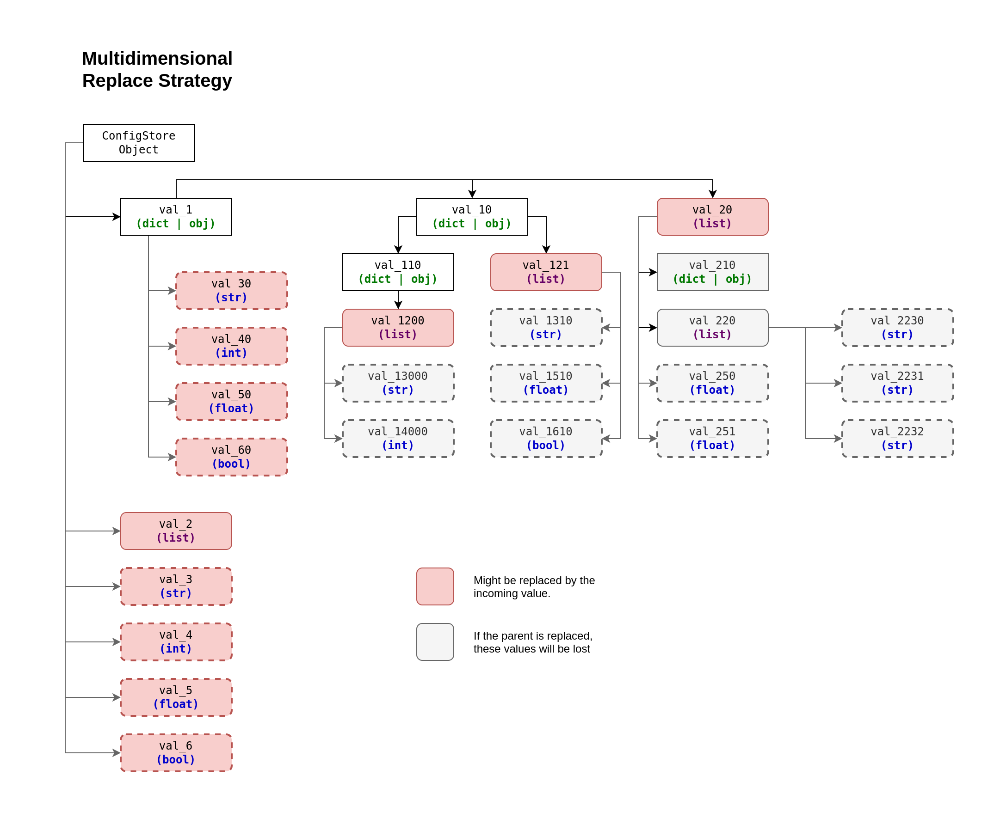
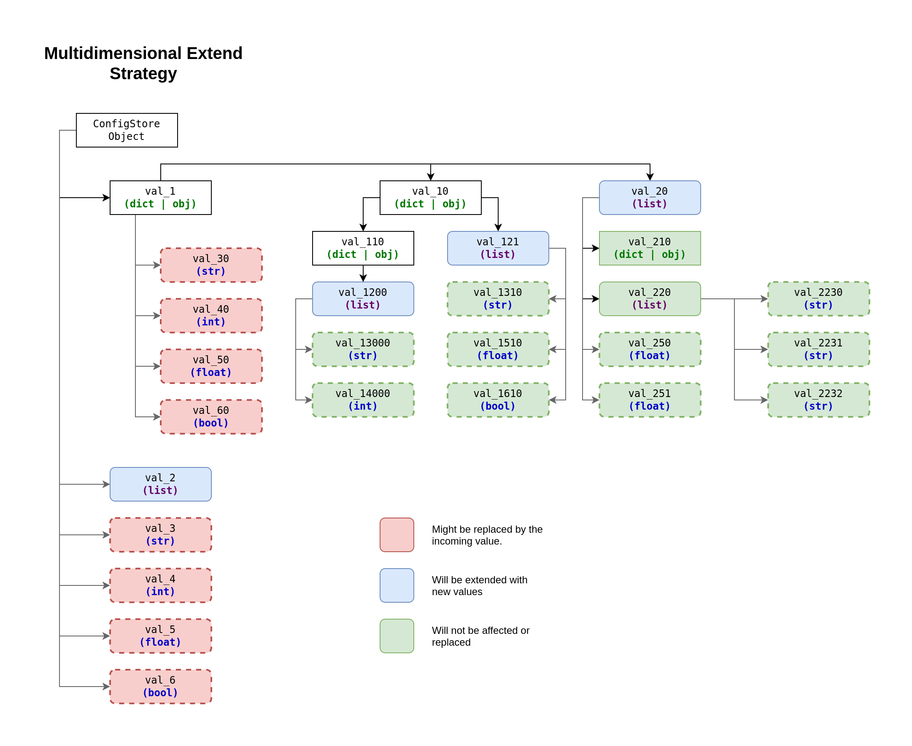

# Config Merging Strategies

> [!NOTE]
> Implementation could be tracked here: 
> https://github.com/PandaHugMonster/py-simputils-config/issues/22

Config Merging Strategies are the ways `ConfigStore` objects can be merged one into another.

There are 3 strategies:
* Flat Strategy (default)
* Multidimensional Replace Strategy
* Multidimensional Extend Strategy

Only the strategy specified to the target `ConfigStore` (the one, into which others are merged).

**Always consider order of precedence of merging `ConfigStore` objects!**

> [!NOTE]
> Hierarchically config is "just a dictionary", so it has levels.
> 
> Each sub-dict, sub-lists or sub-object of this config will be a next level.
> Level refers to the "value of the key", so key-value pair.
> 
> Levels:
> * `Level 0` is considered the config itself (usually referred as an object itself)
>   * Examples: `conf: ConfigStore` (The object itself)
> * `Level 1` is the values of the config
>   * Examples: `conf["my_key_1"]`, `conf["my_key_2"]`
> * `Level 2...` are sub-dicts, sub-lists and sub-objects of corresponding level
>   * Examples: `conf["my_key_1"]["level_2_key"]`, `conf["my_key_2"]["level_2_key"]["level_3_key"]`
>     or `conf["my_key_2"].level_2_key.level_3_key` 
>     (nomenclature is applicable to "dot-notation style" as well)

Strategy can be specified through `strategy` argument for `ConfigStore` constructor:
```python
from simputils.config.components import ConfigHub
from simputils.config.models import ConfigStore

conf = ConfigHub.aggregate(
    {
        "val1": "test",
        "val2": 34,
        "val3": True,
    },

    target=ConfigStore(
        # Even though "flat" strategy is default, 
        # it's a good practice to specify it anyway! 
        strategy=ConfigStore.STRATEGY_FLAT,
    ),
)

print(conf.strategy)
```

Both predefined `string` name or instance of 
`simputils.config.generic.BasicMergingStrategy` and it's derivatives can be supplied 
to `strategy` argument. 

> [!NOTE]
> `preprocessor` and `filter` functionality for `ConfigStore` applied only on Level 1 
> of a strategy, and do not do anything with any internal structure. 
> 
> In case you need that, you have to implement your very own custom `preprocessor` or `filter` to
> accommodate such functionality (and go through all the structures necessary).


## Flat Strategy


This strategy simply replaces the values on a level 1 
with new values from level 1 of the merging config (if exists in the incoming config).

It does not take into account the complexity or the structure/tree of the "value", it just 
replaces the whole "value" with incoming "value".

The **Flat Strategy** is the default one historically, logically and due to compatibility.
Because the initial and major point of configs in this project is to handle 
simple key/value pair loaded from `.env` or OS Environmental Variables 
(not limited to, but was the original idea).

It might look counterintuitive, though that design was done consciously.

> [!NOTE]
> It is considered a good practice to always specify strategy for your config instance,
> even if it's "Flat Strategy" which is default one!


## Multidimensional Strategies

> [!IMPORTANT]
> The multidimensional strategies will work as displayed only
> if the structures of target and incoming configs are the same.
> 
> **If the structures are different, the incompatible types of target one will be replaced with the incoming ones!**

> [!IMPORTANT]
> All the multidimensional strategies could be resource expensive, and even lead to dead loops!

### Multidimensional Replace Strategy



### Multidimensional Extend Strategy


