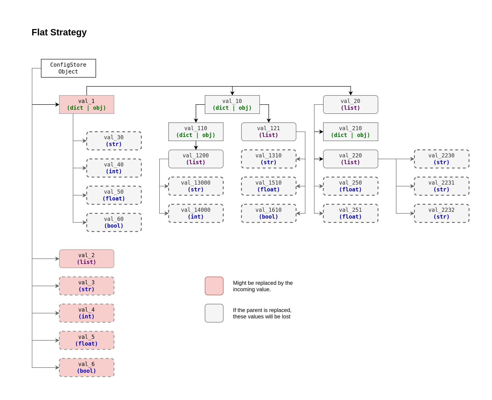
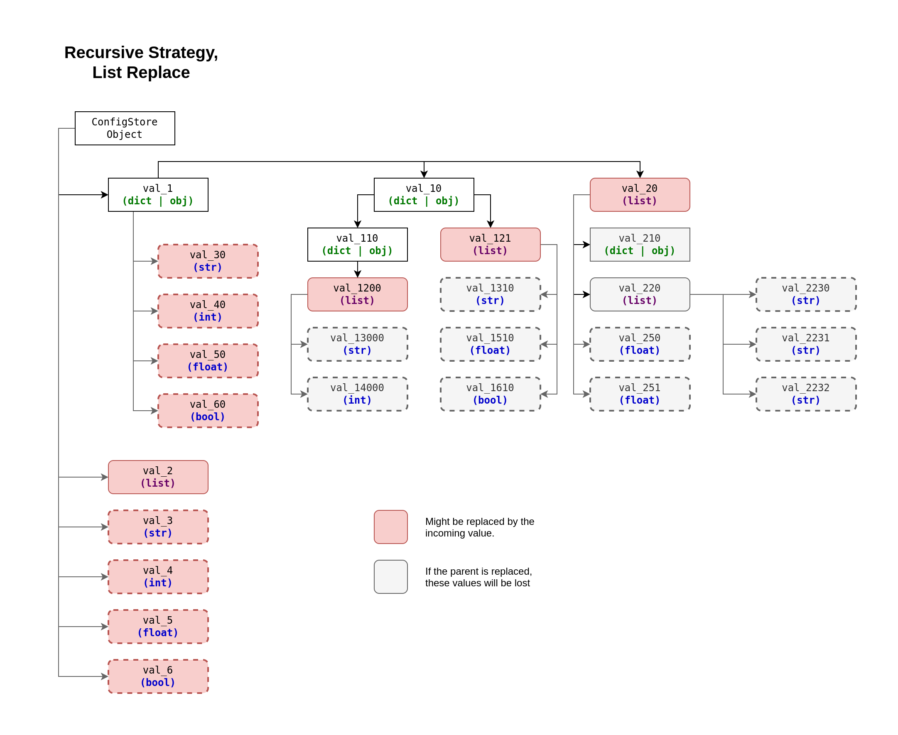

# Config Merging Strategies

> [!NOTE]
> Implementation could be tracked here: 
> https://github.com/PandaHugMonster/py-simputils-config/issues/22

Config Merging Strategies are the ways `ConfigStore` objects can be merged one into another.

There are 2 major strategies:
* Flat Strategy (default)
* Recursive Strategy

Only the strategy specified to the target `ConfigStore` (the one, into which others are merged).
Though if you do custom chaining - it's up to you.

**Always consider order of precedence of merging `ConfigStore` objects!**

> [!NOTE]
> Hierarchically config is "just a dictionary", so it has levels.
> 
> Each sub-dict, sub-lists or sub-object of this config will be a next level.
> Level refers to the "value of the key", so key-value pair.
> 
> Levels:
> * `Level 0` is considered the config itself (usually referred as an object itself)
>   * Examples: `conf: ConfigStore` (The object itself)
> * `Level 1` is the values of the config
>   * Examples: `conf["my_key_1"]`, `conf["my_key_2"]`
> * `Level 2...` are sub-dicts, sub-lists and sub-objects of corresponding level
>   * Examples: `conf["my_key_1"]["level_2_key"]`, `conf["my_key_2"]["level_2_key"]["level_3_key"]`
>     or `conf["my_key_2"].level_2_key.level_3_key` 
>     (nomenclature is applicable to "dot-notation style" as well)

Strategy can be specified through `strategy` argument for `ConfigStore` constructor
(see examples in the sub-sections further).

Both predefined `string` name (or Enum value of `simputils.config.enums.MergingStrategiesEnum`) or instance of
`simputils.config.generic.BasicMergingStrategy` and it's derivatives can be supplied 
to `strategy` argument. 

> [!NOTE]
> `preprocessor` and `filter` functionality for `ConfigStore` applied only on Level 1 
> of a strategy, and do not do anything with any internal structure. 
> 
> In case you need that, you have to implement your very own custom `preprocessor` or `filter` to
> accommodate such functionality (and go through all the sub-structures necessary).


## Flat Strategy



This strategy simply replaces the values on a level 1 
with new values from level 1 of the merging config (if exists in the incoming config).

It does not take into account the complexity or the structure/tree of the "value", it just 
replaces the whole "value" with incoming "value".

The **Flat Strategy** is the default one historically, logically and due to compatibility.
Because the initial and major point of configs in this project is to handle 
simple key/value pair loaded from `.env` or OS Environmental Variables 
(not limited to, but was the original idea).

It might look counterintuitive, though that design was done consciously.

> [!NOTE]
> It is considered a good practice to always specify strategy for your config instance,
> even if it's "Flat Strategy" which is default one!

```python
from simputils.config.components import ConfigHub
from simputils.config.models import ConfigStore
from simputils.config.enums import MergingStrategiesEnum

conf = ConfigHub.aggregate(
    {
        "val1": "test",
        "val2": 34,
        "val3": True,
        "val4": {
            "sub1": {
                "subsub1": [1, 2, 3],
                "subsub2": "something something",
            }
        }
    },
    {
        "val1": "new test",
        "val4": {
            "sub1": {
                "subsub2": "another string",
                "subsub1": [4, 5, 6, 1, 3, 4],
            },
            "sub2": {
                "subsub3": 34,
            }
        }
    },

    target=ConfigStore(
        # Even though "flat" strategy is default,
        # it's a good practice to specify it anyway!
        strategy=MergingStrategiesEnum.FLAT,
    ),
)

print(conf.strategy)
print(conf)
```

Output:
```text
<simputils.config.components.strategies.MergingStrategyFlat.MergingStrategyFlat object at 0x7f058d732620>
{
    'val1': 'new test',
    'val2': 34,
    'val3': True,
    'val4': {
        'sub1': {
            'subsub2': 'another string',
            'subsub1': [4, 5, 6, 1, 3, 4]
        },
        'sub2': {
            'subsub3': 34
        }
    }
}
```

## Recursive Strategy

> [!IMPORTANT]
> Recursive Merging Strategy could be resource expensive, and even lead to dead loops!
>
> Avoid specifying mutual reference and self-reference of the object for this strategy.

> [!NOTE]
> Merge of Pydantic Models (objects) is supported in the same way as dictionaries

### `list_extend` argument

#### List Replace (default)
If argument `list_extend=False` is supplied (default)



```python
from simputils.config.components import ConfigHub
from simputils.config.models import ConfigStore
from simputils.config.enums import MergingStrategiesEnum

conf = ConfigHub.aggregate(
    {
        "val1": "test",
        "val2": 34,
        "val3": True,
        "val4": {
            "sub1": {
                "subsub1": [1, 2, 3],
                "subsub2": "something something",
            }
        }
    },
    {
        "val1": "new test",
        "val4": {
            "sub1": {
                "subsub2": "another string",
                "subsub1": [4, 5, 6, 1, 3, 4],
            },
            "sub2": {
                "subsub3": 34,
            }
        }
    },

    target=ConfigStore(
        strategy=MergingStrategiesEnum.RECURSIVE,
    ),
)

print(conf.strategy)
print(conf)
```

Output:
```text
<simputils.config.components.strategies.MergingStrategyRecursive.MergingStrategyRecursive object at 0x7f058d7327a0>
{
    'val1': 'new test',
    'val2': 34,
    'val3': True,
    'val4': {
        'sub1': {
            'subsub1': [4, 5, 6, 1, 3, 4],
            'subsub2': 'another string'
        },
        'sub2': {
            'subsub3': 34
        }
    }
}
```

You can use Recursive Merging Strategy without arguments through `MergingStrategiesEnum.RECURSIVE` value
as shown above, or creating instance of `simputils.config.components.strategies.MergingStrategyRecursive`
(with or without arguments)


#### List Extend
If argument `list_extend=True` is supplied.

In this case a list of the same position will be extended with the incoming one.

> [!NOTE]
> New values of the list merge, will be simply added, even if they are duplicates!


```python
from simputils.config.components import ConfigHub
from simputils.config.models import ConfigStore
from simputils.config.components.strategies import MergingStrategyRecursive

conf = ConfigHub.aggregate(
    {
        "val1": "test",
        "val2": 34,
        "val3": True,
        "val4": {
            "sub1": {
                "subsub1": [1, 2, 3],
                "subsub2": "something something",
            }
        }
    },
    {
        "val1": "new test",
        "val4": {
            "sub1": {
                "subsub2": "another string",
                "subsub1": [4, 5, 6, 1, 3, 4],
            },
            "sub2": {
                "subsub3": 34,
            }
        }
    },

    target=ConfigStore(
        strategy=MergingStrategyRecursive(list_extend=True),
    ),
)

print(conf.strategy)
print(conf)
```

Output:
```text
<simputils.config.components.strategies.MergingStrategyRecursive.MergingStrategyRecursive object at 0x7f058d731c00>
{
    'val1': 'new test',
    'val2': 34,
    'val3': True,
    'val4': {
        'sub1': {
            'subsub1': [1, 2, 3, 4, 5, 6, 1, 3, 4],
            'subsub2': 'another string'
        },
        'sub2': {
            'subsub3': 34
        }
    }
}
```